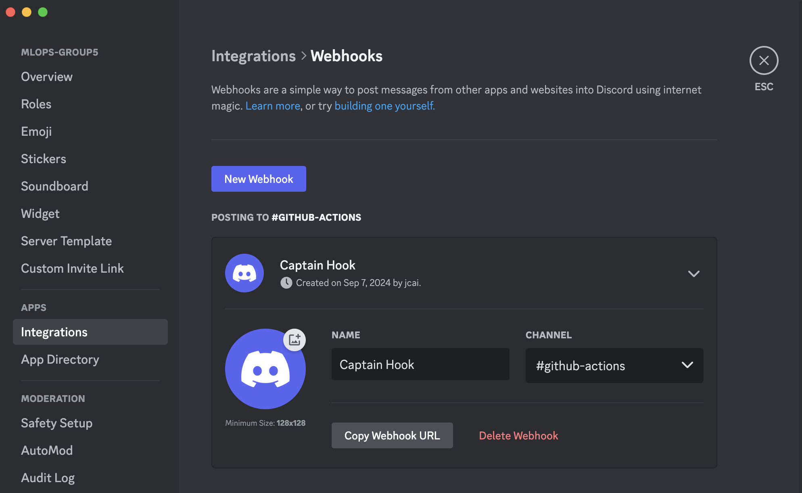
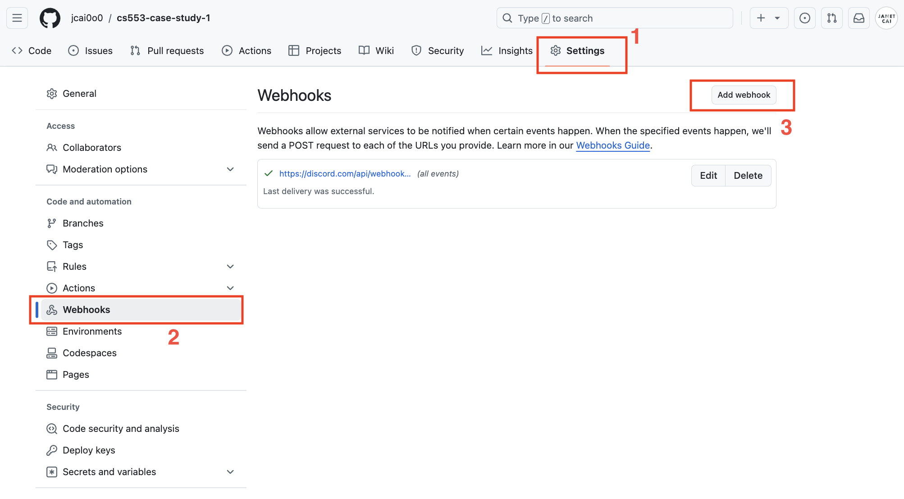
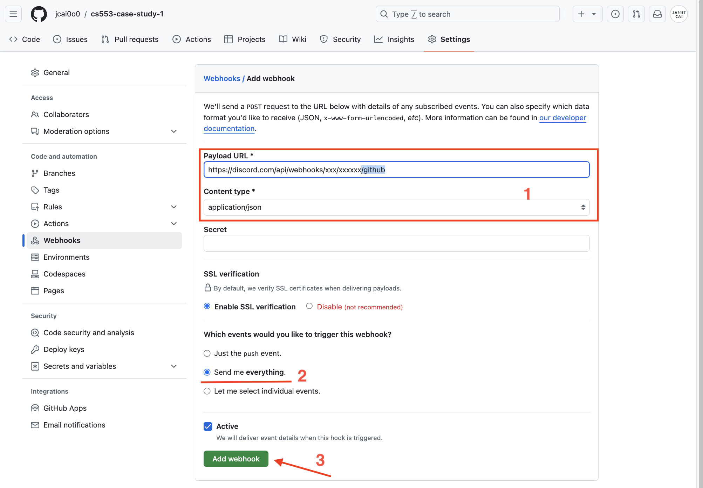
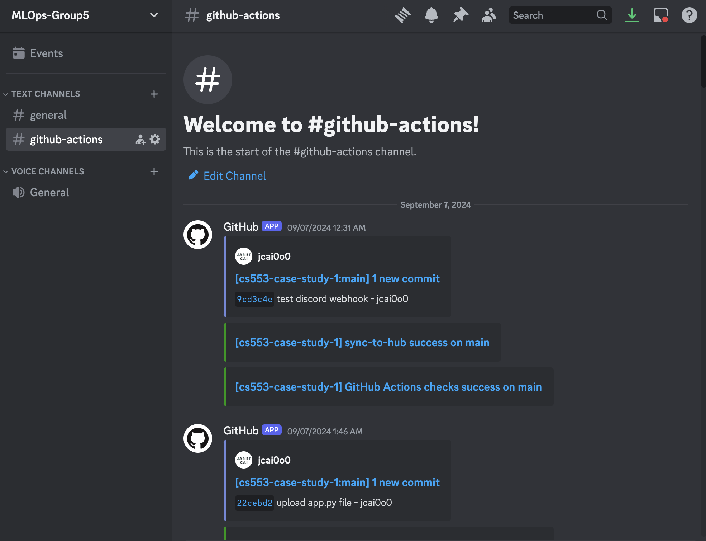

## Messaging team when the GitHub action completes (extra credit)

We chose Discord as our message system. 

First, we created a new text-channel (labeled **#github-actions**) and set up a Webhook. 

With the Webhook URL ready, we added it to our case study 1 repository.
(here, we use a different method than the in-class demo)

We navigated to the "**Settings**" tab in GitHub case study 1 repo, then went to "**Webhooks**" section on the left. We clicked the "**Add webhook**" button in the upper right corner.

To ensure proper message formatting, we appended “**/github**” to the end of the URL. We set the content type as “**application/json**” and configured it to send us all notifications. 

After testing, we found that it worked seamlessly, and we all enjoyed the convenience it provided!

